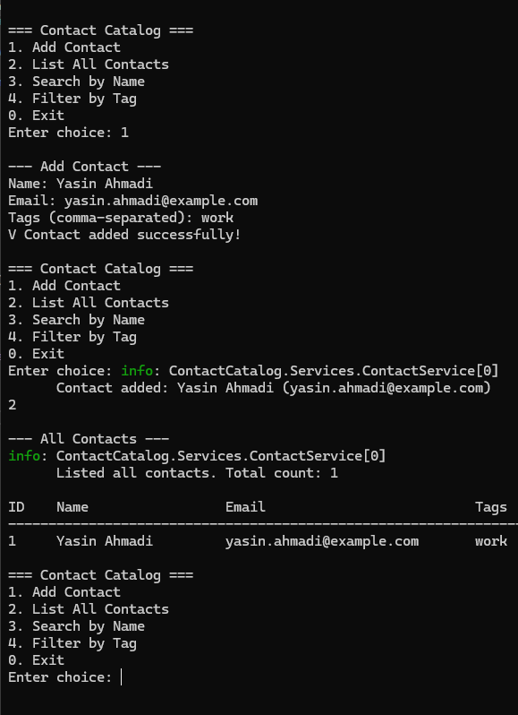

# K1U2---Kontaktkatalogen
This project is a C# .NET 8 console application that manages a contact catalog.
# ContactCatalog

A simple contact catalog implemented as a .NET 8 console application.

The application supports:
- Adding contacts
- Listing all contacts
- Searching contacts by name
- Filtering contacts by tag
- Importing contacts from CSV via a command-line argument

Each contact has:
- `Id` (int, unique)
- `Name`
- `Email`
- `Tags` (list of strings)

---
## Reflection: Data Structures

For storing contacts, I use a `Dictionary<int, Contact>` as the main data structure.

**Why Dictionary?**  
- Fast O(1) lookup by Id
- Guarantees unique Id keys
- Simpler than searching a `List<Contact>` every time

To prevent duplicate email addresses, I also use a `HashSet<string>`.  
Before adding a new contact, the email is checked against the HashSet.  
If it already exists, an `InvalidContactException` is thrown.  
This gives O(1) uniqueness checking and protects against duplicates in memory.

Searching and filtering uses LINQ:
- `SearchByName(query)` uses `Where` and case-insensitive `Contains`, then sorts results with `OrderBy` (by name).
- `FilterByTag(tag)` uses `Where` to match a tag (case-insensitive) and sorts with `OrderBy`.

In other words, I rely on core LINQ methods like `Where`, `OrderBy`, and `Contains` to:
1. filter the data, and
2. present it in a predictable sorted order.


## Project Structure

```text
ContactCatalog/                

├─ ContactCatalog/             # Main project (.NET 8 console app)
│  ├─ Models/
│  │  └─ Contact.cs                   # Contact model (Id, Name, Email, Tags)
│  │
│  ├─ Repositories/
│  │  ├─ IContactRepository.cs        # Abstraction for contact storage
│  │  └─ ContactRepository.cs         # Implementation using Dictionary<int, Contact> and HashSet<string> for unique emails
│  │
│  ├─ Services/
│  │  ├─ ContactService.cs            # Business logic layer: add/list/search/filter + logging
│  │  └─ CsvImportService.cs          # CSV import with per-row error handling and summary
│  │
│  ├─ UI/
│  │  ├─ CommandLineHandler.cs        # Parses command-line args (e.g. -import file.csv)
│  │  ├─ ConsoleDisplay.cs            # Output helpers (printing contacts, summaries, etc.)
│  │  └─ ConsoleMenu.cs               # Interactive console menu (Add, List, Search, Filter, Exit)
│  │
│  ├─ Validators/
│  │  ├─ ContactValidator.cs          # Validates Name/Email, prevents duplicates
│  │  └─ InvalidContactException.cs   # Custom exception thrown when validation fails
│  │
│  ├─ contacts.csv                    # Example CSV with valid contacts
│  ├─ contacts_with_errors.csv        # Example CSV with invalid/broken rows (for testing import failure summary)
│  ├─ Program.cs                      # App entry point: sets up logging, services, menu, CLI mode or interactive mode
│  └─ ContactCatalog.csproj           # Project file for the console app
│
├─ ContactCatalog.Tests/              # Test project
│  ├─ ContactServiceTests.cs          # Tests for ContactService (business logic, logging, search, filter)
│  ├─ EmailValidatorTests.cs          # Tests for ContactValidator email validation 
│  └─ ContactCatalog.Tests.csproj     # Test project file (xUnit, Moq, etc.)
│
├─ RunImage.png                       # Screenshot of the app running
└─ README.md                          # Documentation 
```
                
## 1. How to run

### Requirements
- .NET SDK 8.0 

### 1.1 Run the interactive menu

```bash
dotnet run
dotnet test
```

Below is an example of the program running:




